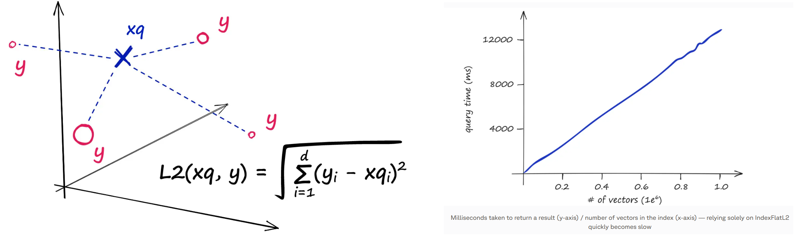
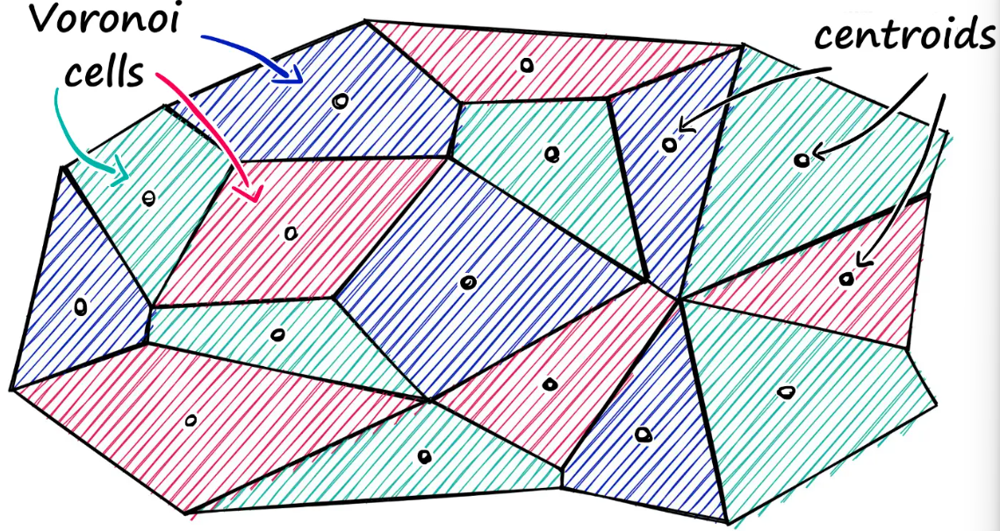
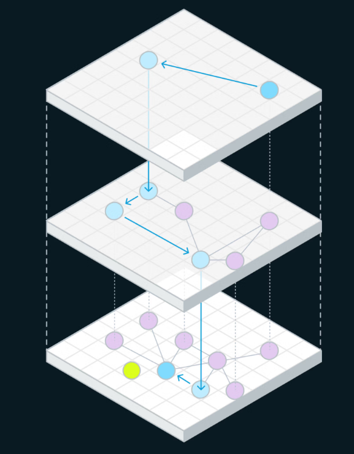

# Papers

**References**:
* [ ] [Faiss: The Missing Manual](https://www.pinecone.io/learn/series/faiss/)
* [ ] [Efficient and robust approximate nearest neighbor search using Hierarchical Navigable Small World graphs](https://arxiv.org/abs/1603.09320)
* [ ] [The Faiss library](https://arxiv.org/abs/2401.08281)

## Similarity Search

### Introduction to Faiss

**What is an index in Faiss?**
* In Faiss, an index is a data structure that organizes your vector embeddings to support nearest-neighbor search efficiently. It's not just a "table" it can include structures, clusters, graphs, or compressed representations optimized for fast search rather than simple storage.

**Why do some Faiss indexes need to be *trained* before adding data?**
* Training in this context means *learning parameters from sample vectors before you add your dataset*.
* Certain index types (e.g., *inverted file* or *quantized* indexes) need to compute data-dependent components like:
    * cluster centroids (e.g., k-means clusters),
    * projection matrices,
    * quantizers for compressing vectors.
* These learned parameters define how the index partitions or compresses the vector space - without them, the search logic can’t function correctly.
* Examples of index types requiring training include:
    * `IndexIVFFlat` (inverted file with flat cells),
    * `IndexIVFPQ` (inverted file plus product quantization),
    * indexes with *PQ*, *OPQ*, or other quantization components.
* In each case, training organizes vectors into clusters or codes so that search can be *approximate but fast and memory-efficient*.

**Why doesn't *every* index need training?**
* Some index types, like the basic `IndexFlatL2`, do **not** require training because they *don't depend on learned parameters*.
    * `IndexFlatL2` simply stores all vectors and does a brute-force comparison at query time.
    * It has no clustering or compression step that needs to be learned.
* As a result, its `index.is_trained` flag is already `True` (meaning *no pre-training needed*).

**What is IndexFlatL2**
* **IndexFlatL2** measures the L2 (or Euclidean) distance between all given points between our query vector, and the vectors loaded into the index. It’s simple, very accurate, but not too fast.
* It doesn't scale well because when using this index, we are performing an *exhaustive* search - meaning we compare our query vector xq to every other vector in our index.
    

**IndexIVFFlat**
* IndexIVFFlat is built on the idea that most of the time you do not need to compare a query vector against *every* vector in your dataset. Instead, the vector space is first partitioned into regions using clustering, typically k-means. During training, the index learns a set of cluster centroids that act as coarse representatives of the space. Once trained, every vector you add is assigned to the single centroid it is closest to, and stored in that centroid’s bucket.
* At query time, the same logic is applied to the query vector. The index first finds which centroids the query is closest to, then searches only the vectors that were assigned to those centroids. Inside those buckets, however, there is no approximation: the original vectors are stored in full, and distances are computed exactly. The approximation comes purely from *not searching everywhere*, not from distorting the vectors themselves.
* Conceptually, IndexIVFFlat trades global exhaustiveness for locality. You gain speed by pruning most of the dataset up front, while preserving high accuracy inside the regions you do search. This makes it a common "first serious" index once brute-force search becomes too slow but you are not yet constrained by memory.

**IndexIVFPQ**
* IndexIVFPQ starts from exactly the same inverted-file idea as IndexIVFFlat: the space is clustered during training, vectors are assigned to centroid buckets, and queries only probe a small number of those buckets. The difference is what happens *after* a vector is assigned to a bucket.
* Instead of storing the full vector, IndexIVFPQ compresses it using product quantization. The vector is split into multiple low-dimensional subspaces, and each subspace is quantized independently using a small learned codebook. What gets stored is not the original floating-point vector, but a compact sequence of code indices that approximate it. This dramatically reduces memory usage and improves cache efficiency.
* At search time, distances are no longer computed exactly. Instead, the query is compared against precomputed lookup tables derived from the PQ codebooks, yielding an approximate distance. You are now approximating in two places: first by only searching some clusters, and second by using compressed representations inside those clusters.
* The result is an index that scales to tens or hundreds of millions of vectors on modest hardware. The cost is lower recall unless the index is carefully tuned, but the payoff is that problems which would otherwise be infeasible become tractable.

**Why do we call it inverted filed indexes?**
* The term **"inverted file index"** comes directly from classical information-retrieval systems, long before vector search or Faiss existed. Understanding the name is easiest if you start from what the *non-inverted* view looks like.
* In a naive representation, data is organized **by document (or by vector)**. Each document contains terms; each vector exists as a standalone object you must inspect. If you want to answer a query, you scan through many documents or vectors and check whether they are relevant. This is the "forward" view: *document → contents* or *vector → coordinates*.
* An inverted index flips that relationship. Instead of asking "what is inside this document or vector?", it answers "which documents or vectors belong to this concept?" In text search, the classic example is a word pointing to a list of documents that contain it. The *file* part refers to these stored lists, and *inverted* refers to reversing the lookup direction.
* Faiss adopts the same naming because IVF does the same conceptual inversion, just with geometry instead of words. Rather than storing vectors as primary objects that you iterate over, the index stores **regions of space** - defined by learned centroids - and for each region it keeps a list of vectors that belong there. The primary lookup is no longer "vector ID → vector," but "cluster ID → vectors assigned to that cluster."
* What is being inverted, then, is the access pattern. Instead of starting from vectors and discovering where they lie in space, you start from regions of space and retrieve the vectors that fall into them. At query time, you first decide *which regions are relevant*, and only then touch the vectors inside those regions.
* This inversion is why IVF scales. The index turns a global search problem into a selective retrieval problem, exactly like text search engines avoid scanning every document for every query. The name "inverted file index" is a historical carry-over, but it is also conceptually accurate: Faiss inverts vector lookup around learned spatial buckets rather than raw vector storage.

**Vector Quantization based Clustering**
* Faiss relies primarily on **vector quantization–based clustering**, with **k-means** as the dominant algorithm. When you train an IVF index, Faiss runs k-means on a sample of your vectors to learn a fixed number of centroids that partition the space. These centroids define the inverted lists. Variants exist such as hierarchical k-means (used internally for very large `nlist` values) and optimizations around initialization and batching, but conceptually, it is still k-means operating in high-dimensional embedding space. This choice is deliberate: k-means is fast, scalable, and produces centroids that minimize average squared distance, which aligns directly with L2 or inner-product search objectives used in Faiss.
* Your intuition about the fragility of centroid assignments is correct. IVF assumes that vectors can be reasonably approximated by a **Voronoi partition** of the space, where each point belongs to its nearest centroid. In real embedding distributions, especially those produced by modern neural models, this assumption is often violated. Embeddings frequently live on curved manifolds, have anisotropic density, or form elongated and overlapping clusters. In these cases, a hard assignment to a single centroid is an artificial simplification: a vector near a decision boundary may be nearly equidistant from multiple centroids, and small perturbations can flip its assignment.
* This leads to the core failure mode of IVF: **recall loss due to misassignment**. If a query and its true nearest neighbor fall into different centroid buckets, and that bucket is not probed at search time, the neighbor is never even considered. This is not a distance-approximation error; it is a *routing error*. The vector exists in the index, but the search never looks where it lives.
* Faiss measures and exposes this problem indirectly rather than explicitly. During evaluation, you typically compare IVF results against a brute-force baseline and compute recall@k. As you vary the number of probed centroids, you can observe how recall recovers. A sharp recall improvement as `nprobe` increases is a strong signal that boundary effects and overlapping clusters are present. Another indicator is centroid occupancy imbalance: if some inverted lists are very large while others are nearly empty, the k-means partition is not well matched to the data distribution.
* Faiss mitigates centroid ambiguity through **controlled redundancy rather than perfect clustering**. The most important lever is probing multiple centroids at query time. By searching several nearby regions instead of only the closest one, the index compensates for the fact that boundaries are fuzzy. This is not a bug workaround; it is an intentional design choice that treats clustering as a coarse routing mechanism, not a hard semantic partition.
* Training choices also matter. Using a sufficiently large and representative training sample reduces centroid collapse and improves boundary placement. Increasing the number of centroids reduces average list size, which sharpens locality, but also increases the risk of boundary fragmentation, so it must be balanced with a higher probe count. In practice, IVF is tuned as a system, not as a pure clustering solution.
* More advanced Faiss indexes acknowledge these limitations explicitly. Variants like HNSW-based quantizers or hybrid IVF-HNSW indexes replace pure k-means routing with graph-based neighborhood exploration, which is far more tolerant of overlapping structure. Product quantization further accepts that geometry will be distorted and focuses on probabilistic ranking rather than exact neighborhood preservation.
* The key mental shift is this: **Faiss does not assume your vectors are "naturally clusterable" in a semantic sense**. It assumes only that *locality exists*, that nearby vectors are more likely than distant ones to share neighbors. IVF centroids are a computational scaffold to exploit that locality, not a claim about true cluster membership. The quality of an IVF index is therefore measured not by how "correct" its clusters are, but by how quickly recall converges as you relax its routing constraints.
* All of these mechanisms reflect the same philosophy found throughout Faiss: accept that high-dimensional geometry is messy, and trade exactness for controllable, measurable approximation rather than pretending clean partitions exist.

**Partitioning The Index**

Faiss allows us to add multiple steps that can optimize our search using many different methods. A popular approach is to partition the index into Voronoi cells.

### NN Indexes for Similarity Search

### Locality Sensitive Hashing

### Random Projection for LSH

### Product Quantization

### Hierarchical Navigable Small Worlds

### Composite Indexes and the Faiss Index Factory

## HNSW

I am reading the attached research paper, my goal is to finish reading this and implement hnsw using rust from scratch. I dont want you to write any code. I will let you know before I start implementation. Right now, below are some questions I have on the paper:
1. what are navigable small world graphs? is it a new thing when the paper was released or does this paper build upon an existing technique?
2. "The proposed solution is fully graph-based, without any need for additional search structures, which  are  typically  used  at  the  coarse  search  stage  of  the  most  proximity  graph  techniques." what are these additional search structures mean, I dont have context on this. Whats the coarse search stage, what are proximity graph techniques?
3. 

### Introduction

Hierarchical Navigable Small World (HNSW) incrementally builds a multi-layer structure consisting from hierarchical set of proximity graphs (layers) for nested subsets of the stored elements.

