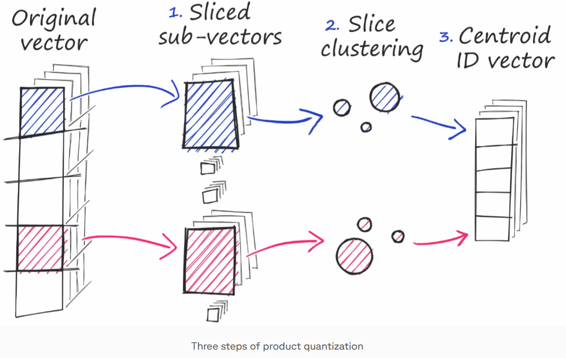
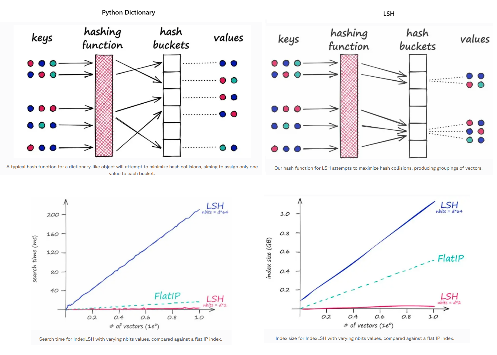
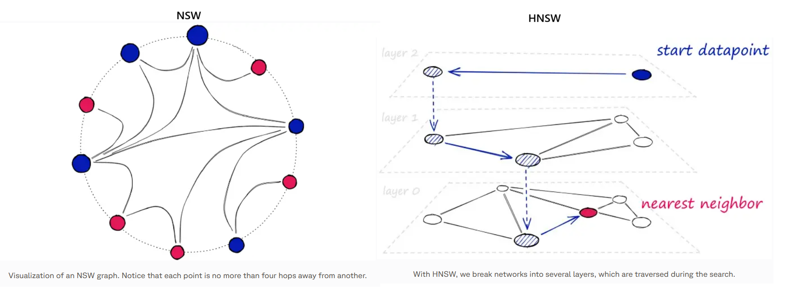
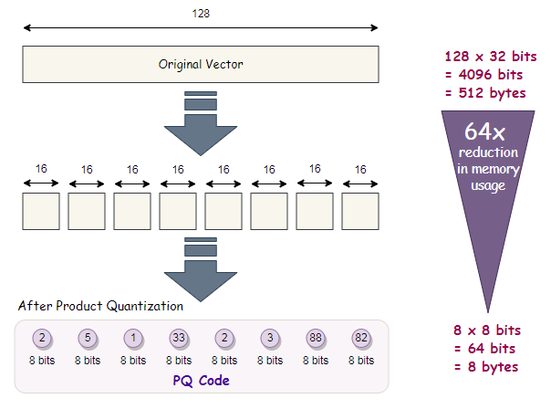

# Papers

**References**:
* [ ] [Faiss: The Missing Manual](https://www.pinecone.io/learn/series/faiss/)
* [ ] [Efficient and robust approximate nearest neighbor search using Hierarchical Navigable Small World graphs](https://arxiv.org/abs/1603.09320)
* [ ] [The Faiss library](https://arxiv.org/abs/2401.08281)
* [ ] [Billion-scale similarity search with GPUs](https://arxiv.org/abs/1702.08734)


## Similarity Search

### Introduction to Faiss

**What is an index in Faiss?**
* In Faiss, an index is a data structure that organizes your vector embeddings to support nearest-neighbor search efficiently. It's not just a "table" it can include structures, clusters, graphs, or compressed representations optimized for fast search rather than simple storage.

**Why do some Faiss indexes need to be *trained* before adding data?**
* Training in this context means *learning parameters from sample vectors before you add your dataset*.
* Certain index types (e.g., *inverted file* or *quantized* indexes) need to compute data-dependent components like:
    * cluster centroids (e.g., k-means clusters),
    * projection matrices,
    * quantizers for compressing vectors.
* These learned parameters define how the index partitions or compresses the vector space - without them, the search logic can't function correctly.
* Examples of index types requiring training include:
    * `IndexIVFFlat` (inverted file with flat cells),
    * `IndexIVFPQ` (inverted file plus product quantization),
    * indexes with *PQ*, *OPQ*, or other quantization components.
* In each case, training organizes vectors into clusters or codes so that search can be *approximate but fast and memory-efficient*.

**Why doesn't *every* index need training?**
* Some index types, like the basic `IndexFlatL2`, do **not** require training because they *don't depend on learned parameters*.
    * `IndexFlatL2` simply stores all vectors and does a brute-force comparison at query time.
    * It has no clustering or compression step that needs to be learned.
* As a result, its `index.is_trained` flag is already `True` (meaning *no pre-training needed*).

**What is IndexFlatL2**
* **IndexFlatL2** measures the L2 (or Euclidean) distance between all given points between our query vector, and the vectors loaded into the index. It's simple, very accurate, but not too fast.
* It doesn't scale well because when using this index, we are performing an *exhaustive* search - meaning we compare our query vector xq to every other vector in our index.
    

**IndexIVFFlat**
* IndexIVFFlat is built on the idea that most of the time you do not need to compare a query vector against *every* vector in your dataset. Instead, the vector space is first partitioned into regions using clustering, typically k-means. During training, the index learns a set of cluster centroids that act as coarse representatives of the space. Once trained, every vector you add is assigned to the single centroid it is closest to, and stored in that centroid's bucket.
* At query time, the same logic is applied to the query vector. The index first finds which centroids the query is closest to, then searches only the vectors that were assigned to those centroids. Inside those buckets, however, there is no approximation: the original vectors are stored in full, and distances are computed exactly. The approximation comes purely from *not searching everywhere*, not from distorting the vectors themselves.
* Conceptually, IndexIVFFlat trades global exhaustiveness for locality. You gain speed by pruning most of the dataset up front, while preserving high accuracy inside the regions you do search. This makes it a common "first serious" index once brute-force search becomes too slow but you are not yet constrained by memory.

**Why do we call it inverted filed indexes?**
* The term **"inverted file index"** comes directly from classical information-retrieval systems, long before vector search or Faiss existed. Understanding the name is easiest if you start from what the *non-inverted* view looks like.
* In a naive representation, data is organized **by document (or by vector)**. Each document contains terms; each vector exists as a standalone object you must inspect. If you want to answer a query, you scan through many documents or vectors and check whether they are relevant. This is the "forward" view: *document → contents* or *vector → coordinates*.
* An inverted index flips that relationship. Instead of asking "what is inside this document or vector?", it answers "which documents or vectors belong to this concept?" In text search, the classic example is a word pointing to a list of documents that contain it. The *file* part refers to these stored lists, and *inverted* refers to reversing the lookup direction.
* Faiss adopts the same naming because IVF does the same conceptual inversion, just with geometry instead of words. Rather than storing vectors as primary objects that you iterate over, the index stores **regions of space** - defined by learned centroids - and for each region it keeps a list of vectors that belong there. The primary lookup is no longer "vector ID → vector," but "cluster ID → vectors assigned to that cluster."
* What is being inverted, then, is the access pattern. Instead of starting from vectors and discovering where they lie in space, you start from regions of space and retrieve the vectors that fall into them. At query time, you first decide *which regions are relevant*, and only then touch the vectors inside those regions.
* This inversion is why IVF scales. The index turns a global search problem into a selective retrieval problem, exactly like text search engines avoid scanning every document for every query. The name "inverted file index" is a historical carry-over, but it is also conceptually accurate: Faiss inverts vector lookup around learned spatial buckets rather than raw vector storage.

**Vector Quantization based Clustering**
* Faiss relies primarily on **vector quantization–based clustering**, with **k-means** as the dominant algorithm. When you train an IVF index, Faiss runs k-means on a sample of your vectors to learn a fixed number of centroids that partition the space. These centroids define the inverted lists. Variants exist such as hierarchical k-means (used internally for very large `nlist` values) and optimizations around initialization and batching, but conceptually, it is still k-means operating in high-dimensional embedding space. This choice is deliberate: k-means is fast, scalable, and produces centroids that minimize average squared distance, which aligns directly with L2 or inner-product search objectives used in Faiss.
* Your intuition about the fragility of centroid assignments is correct. IVF assumes that vectors can be reasonably approximated by a **Voronoi partition** of the space, where each point belongs to its nearest centroid. In real embedding distributions, especially those produced by modern neural models, this assumption is often violated. Embeddings frequently live on curved manifolds, have anisotropic density, or form elongated and overlapping clusters. In these cases, a hard assignment to a single centroid is an artificial simplification: a vector near a decision boundary may be nearly equidistant from multiple centroids, and small perturbations can flip its assignment.
* This leads to the core failure mode of IVF: **recall loss due to misassignment**. If a query and its true nearest neighbor fall into different centroid buckets, and that bucket is not probed at search time, the neighbor is never even considered. This is not a distance-approximation error; it is a *routing error*. The vector exists in the index, but the search never looks where it lives.
* Faiss measures and exposes this problem indirectly rather than explicitly. During evaluation, you typically compare IVF results against a brute-force baseline and compute recall@k. As you vary the number of probed centroids, you can observe how recall recovers. A sharp recall improvement as `nprobe` increases is a strong signal that boundary effects and overlapping clusters are present. Another indicator is centroid occupancy imbalance: if some inverted lists are very large while others are nearly empty, the k-means partition is not well matched to the data distribution.
* Faiss mitigates centroid ambiguity through **controlled redundancy rather than perfect clustering**. The most important lever is probing multiple centroids at query time. By searching several nearby regions instead of only the closest one, the index compensates for the fact that boundaries are fuzzy. This is not a bug workaround; it is an intentional design choice that treats clustering as a coarse routing mechanism, not a hard semantic partition.
* Training choices also matter. Using a sufficiently large and representative training sample reduces centroid collapse and improves boundary placement. Increasing the number of centroids reduces average list size, which sharpens locality, but also increases the risk of boundary fragmentation, so it must be balanced with a higher probe count. In practice, IVF is tuned as a system, not as a pure clustering solution.
* More advanced Faiss indexes acknowledge these limitations explicitly. Variants like HNSW-based quantizers or hybrid IVF-HNSW indexes replace pure k-means routing with graph-based neighborhood exploration, which is far more tolerant of overlapping structure. Product quantization further accepts that geometry will be distorted and focuses on probabilistic ranking rather than exact neighborhood preservation.
* The key mental shift is this: **Faiss does not assume your vectors are "naturally clusterable" in a semantic sense**. It assumes only that *locality exists*, that nearby vectors are more likely than distant ones to share neighbors. IVF centroids are a computational scaffold to exploit that locality, not a claim about true cluster membership. The quality of an IVF index is therefore measured not by how "correct" its clusters are, but by how quickly recall converges as you relax its routing constraints.
* All of these mechanisms reflect the same philosophy found throughout Faiss: accept that high-dimensional geometry is messy, and trade exactness for controllable, measurable approximation rather than pretending clean partitions exist.

**Partitioning The Index**
* By partitioning the index into Voronoi cells, we would take a query vector xq, identify the cell it belongs to, and then use our IndexFlatL2 (or another metric) to search between the query vector and all other vectors belonging to that specific cell.
    
* If approximate search with `IndexIVFFlat` returns suboptimal results, we can improve accuracy by increasing the search scope. We do this by increasing the `nprobe` attribute value - which defines how many nearby cells to search.

**Voronoi cell**
* A Voronoi cell is a region of space defined around a reference point such that **every location inside that region is closer to that reference point than to any other**. If you place several points in space and ask, "for every possible location, which point is the nearest?", the answer partitions the space into contiguous regions. Each of those regions is a Voronoi cell, and the collection of all cells is called a Voronoi diagram.
* This construction arises naturally from the idea of nearest distance. No extra assumptions are required beyond having a distance metric. Once you define distance, the partition follows automatically. That is why Voronoi cells appear in so many domains: computational geometry, physics, wireless networks, clustering, and vector search. They are not an arbitrary choice; they are the mathematically minimal way to assign every point in space to a representative.
* In the context of Faiss and IVF indexes, the reference points are the learned centroids. When Faiss trains an IVF index, it learns a fixed set of centroids, and those centroids implicitly define a Voronoi partition of the embedding space. Every vector you add is assigned to the centroid it is closest to, which means it is placed into that centroid's Voronoi cell. There is no explicit construction of cell boundaries; the boundaries are implicit, defined by pairwise distance comparisons.
* Voronoi partitioning is used because it provides **deterministic routing with minimal computation**. Given a query vector, you only need to compute distances to the centroids and select the nearest ones. This gives you an immediate, well-defined subset of the space to search. Importantly, this routing step is independent of how many vectors exist inside each region, which makes it scale well.
* However, Voronoi cells come with a critical limitation that you already intuited. The boundaries between cells are hard decision surfaces. A point near a boundary may be almost equally close to multiple centroids, yet it is forced into exactly one cell. In high-dimensional spaces, these boundaries become extremely complex and unintuitive, and small perturbations can change assignments. This is why IVF does not rely on a single cell at query time, but instead probes multiple nearby cells to soften the boundary effects.
* The reason Voronoi cells remain useful despite this weakness is that they offer a **geometrically grounded first approximation**. They do not claim semantic correctness; they simply guarantee that vectors routed together are closer to the same representative than to others. Faiss treats this partition as a coarse filter, not as a final answer. The true nearest-neighbor decision is deferred to later stages of the search.
* In short, Voronoi cells are used because they are the simplest, most principled way to divide space based purely on distance. Faiss leverages them as a fast routing mechanism, fully aware that real embedding spaces violate the clean assumptions implied by such partitions.

**I noticed that sometimes `nprobe=10` look faster than `nprobe=1`, Why?**
1. **Warm caches / page faults / allocator warmup**
    * The first run often pays one-time costs: loading the index pages into RAM, touching inverted lists, warming instruction cache/branch predictor, initializing thread pools, etc.
    * If you benchmark `nprobe=1` first and `nprobe=10` second, you can easily see the second one faster even if it does more work.
2. **CPU frequency / turbo behavior**
    * Short microbenchmarks are noisy. The CPU may boost differently from run to run depending on temperature/power and what else is running.
3. **Threading and scheduling effects**
    * FAISS uses OpenMP in many builds. Different workloads can schedule differently across cores, and small changes can shift you from “unlucky scheduling” to “good parallel occupancy”.
4. **Memory locality differences (this is real)**
    * Query time is often dominated by memory access, not FLOPs.
    * With `nprobe=1`, you might hit one very large inverted list and do a lot of scattered reads that trash caches/TLBs.
    * With `nprobe=10`, you may touch several smaller lists whose data happens to be laid out or reused more favorably, giving better locality—even if the total candidate count is slightly larger.
5. **You might be under a scan cap**
    * If you (or defaults in wrappers) set something like `index.max_codes` (IVF), then increasing `nprobe` doesn't necessarily increase scanned codes; it can just change *which* codes you scan. That can change memory behavior and time.

**Quantization**
* Where IVF allowed us to approximate by *reducing the scope* of our search, Product Quantization (PQ) approximates the *distance/similarity calculation* instead.
* PQ achieves this approximated similarity operation by compressing the vectors themselves, which consists of three steps.
    1. We split the original vector into several subvectors.
    2. For each set of subvectors, we perform a clustering operation - creating multiple centroids for each sub-vector set.
    3. In our vector of sub-vectors, we replace each sub-vector with the ID of it's nearest set-specific centroid.
    

### Nearest Neighbor Indexes for Similarity Search

**Indexes in Search**
There are two primary approaches to make search faster:
* Reduce vector size - through dimensionality reduction or reducing the number of bits representing our vectors values.
* Reduce search scope - we can do this by clustering or organizing vectors into tree structures based on certain attributes, similarity, or distance - and restricting our search to closest clusters or filter through most similar branches.

**Locality Sensitive Hashing**
* Locality Sensitive Hashing (LSH) works by grouping vectors into buckets by processing each vector through a hash function that maximizes hashing collisions - rather than minimizing as is usual with hashing functions.
* What does that mean? Imagine we have a Python dictionary. When we create a new key-value pair in our dictionary, we use a hashing function to hash the key. This hash value of the key determines the 'bucket' where we store its respective value. A Python dictionary is an example of a hash table using a typical hashing function that minimizes hashing collisions, a hashing collision where two different objects (keys) produce the same hash. In our dictionary, we want to avoid these collisions as it means that we would have multiple objects mapped to a single key - but for LSH, we want to **maximize** hashing collisions.
* Why would we want to maximize collisions? Well, for search, we use LSH to group similar objects together. When we introduce a new query object (or vector), our LSH algorithm can be used to find the closest matching groups:
    
* IndexLSH is not suitable if we have large vector dimensionality. Instead, it is best suited to low-dimensionality vectors - and small indexes. If we find ourselves with large d values or large indexes - we avoid LSH completely, instead focusing on our next index, HNSW.

**Hierarchical Navigable Small World Graphs**
* HNSW is an adaption of navigable small world (NSW) graphs - where an NSW graph is a graph structure containing vertices connected by edges to their nearest neighbors. The 'NSW' part is due to vertices within these graphs all having a very short average path length to all other vertices within the graph - despite not being directly connected.
* At a high level, HNSW graphs are built by taking NSW graphs and breaking them apart into multiple layers. With each incremental layer eliminating intermediate connections between vertices.
    

**Faiss index choice**
* Faiss index choice is mostly a decision about where you want to pay: RAM, build time, and latency versus recall. The library's own guidance starts with "if you have lots of RAM or the dataset is small, HNSW is often the best option," and treats IVF+PQ as the workhorse when you need large-scale and compression.
* **Flat indexes (IndexFlatL2 / IndexFlatIP)** - A Flat index is the baseline: it stores full vectors and compares the query to every vector. You pick it when the dataset is small enough that brute force is acceptable, or when you need the cleanest quality reference to measure recall for approximate methods. It shines when you have very high search frequency but still modest N (or you’re on GPU and can brute force fast). It does not require training and quality is "as good as your embedding + metric," because there’s no approximation.
* **HNSW graph indexes (IndexHNSWFlat and variants)** - HNSW builds a navigable graph over vectors and searches by graph traversal. Practically, it is a top choice when you want high recall and low latency without the operational complexity of training/quantization, and you can afford higher RAM per vector plus non-trivial build time. Faiss exposes the main tradeoffs through parameters like link count and search exploration, which directly move you along the speed-recall curve. Choose HNSW when you expect frequent queries and want strong quality at millisecond latency, especially for up to "single-node feasible" sizes (often millions to tens of millions depending on RAM).
* **IVF coarse quantization (IndexIVFFlat)** - IVF clusters the full vector space into `nlist` regions (coarse centroids), stores vectors in per-centroid inverted lists, and at query time probes only `nprobe` lists. This is the "restrict the search region" mechanism: if a list is not probed, vectors inside it are never considered. IndexIVFFlat keeps full vectors inside lists, so within probed lists the distance computation is exact; approximation comes from not visiting all lists. This is a strong option when N is large enough that Flat is too slow, but you still want high quality and can afford storing full vectors.
* **IVF with Product Quantization (IndexIVFPQ)** - IndexIVFPQ keeps the same IVF candidate restriction but compresses vectors (typically residuals) with PQ codes so that scanning candidates is much cheaper in memory and compute. In Faiss’s definition, IVFPQ encodes each residual vector with a product quantizer code. This is the classic choice when dataset size is very large and RAM is the limiter. You trade quality for scalability, but you regain a lot of quality by probing more lists and optionally re-ranking a small candidate set with exact distances (or using refinement variants).
* **Standalone PQ / compressed flat (IndexPQ / IndexFlatCodes / scalar quantization families)** - These are for compressing vectors even without IVF. They reduce memory and speed up scanning via code-based distance computations, but without IVF or a graph they do not have a strong "where to look" mechanism. In practice, they are usually paired with IVF or used when you already have a strong external candidate generator and just want compact scoring.
* **LSH (IndexLSH)** - Faiss's IndexLSH hashes vectors into binary codes and compares codes with Hamming distance; Faiss explicitly notes it is essentially a flat index over binary codes. LSH is easy to use and has low memory per vector, but in modern embedding retrieval it is usually not the best quality–speed tradeoff compared to HNSW or IVF variants. It can make sense when you want a very simple, training-light baseline for approximate search, or when Hamming-space retrieval is a good fit for your application constraints.

**How to pick quickly (rules of thumb)**
* If you need a reliable starting point and can afford RAM, prefer HNSW over LSH and often over IVF because it typically gives excellent recall at low latency without training complexity.
* If the dataset is small or you need ground-truth quality measurements, use Flat.
* If the dataset is large and you need predictable scaling knobs, use IVF; if RAM becomes the bottleneck, move to IVFPQ (and plan to tune `nlist`, `nprobe`, and possibly add re-ranking).
* Treat LSH as a niche/simple baseline rather than a default for high-recall semantic search in 2026-era embedding systems.

### Locality Sensitive Hashing


### Random Projection for LSH


### Product Quantization

**How does Product Quantization Work?**
* *My concern with Product Quantization was, say I have a 100D vector, if we split this into lower-dimensional pieces doesn't this destroy the meaning of the vector?*
* The key idea behind PQ is that **distance can be approximated without preserving the full semantic structure of the vector**. PQ does not try to preserve the vector as a whole; it tries to preserve *enough information to rank neighbors correctly*. Those are very different goals.
* When you split a 100-D vector into subvectors, you are not claiming that each subvector is meaningful on its own. You are assuming something weaker: that the total distance between two vectors can be approximated as the *sum of distances between corresponding parts*. For L2 distance, this is mathematically true. The squared L2 distance decomposes cleanly across dimensions, which makes this kind of factorization possible. So PQ is exploiting a property of the distance function, not a property of semantic meaning.
* Now let's walk through what happens internally if we have 200 vectors, each 100-D and we choose `m = 5` and `bits = 10`.
* Choosing `m = 5` means that each vector is split into 5 contiguous subvectors. Since the original dimensionality is 100, each subvector has 20 dimensions. Every vector is now represented as five 20-D chunks. This split is fixed and positional: dimension 0–19 go into subvector 1, 20–39 into subvector 2, and so on. No learning happens here; this is a structural decision.
* Next comes the part where learning *does* happen. For each of the five subvector positions, Faiss learns a separate codebook by clustering. In your case, `bits = 10` means each subvector codebook has $2^10$ = 1024 centroids. Importantly, these are not shared across subvectors. Subvector position 1 has its own 1024 centroids, subvector position 2 has a different 1024, and so on. Each codebook is trained only on the data from that specific slice of the vectors.
* But it is important to be precise about *what data is being clustered*. You are not clustering "200 vectors into 1024 centroids." You are clustering **subvectors**. If you have 200 vectors of dimension 100 and you choose `m = 5`, you now have 200 subvectors per subspace, each 20-dimensional, and this is done independently for each of the five subspaces. So each PQ codebook is trained on 200 points in a 20-D space.
* Conceptually, you should not think of PQ centroids as "semantic clusters." They are **vector quantization bins** whose job is to tile the subspace finely enough that distance distortion is bounded. The centroids are not meaningful; they are anchors used to discretize geometry.
* Now consider what it means to add one vector to the index. You take its first 20-D subvector and find the nearest centroid in codebook 1, producing an integer ID between 0 and 1023. You repeat this independently for each of the remaining four subvectors. The original 100-D floating-point vector is now replaced by five small integers. Those five integers are the compressed representation.
* This is the crucial point: **the vector is not stored as geometry anymore**. It is stored as a tuple of centroid IDs. All fine-grained information inside each 20-D block is discarded except for "which centroid was closest."
* At query time, something clever happens. The query vector is split into the same five subvectors. For each subvector, Faiss computes the distance from the query subvector to *all* 1024 centroids in that subspace and stores the results in a lookup table (these lookup tables are computed **fresh per query** and thrown away after). That gives you five tables of precomputed distances. When the index evaluates a stored vector, it does not reconstruct the vector. Instead, it looks up five numbers-one per subvector-and sums them. That sum is an approximation of the full 100-D distance.
* So when you ask "what does 5 m and 10 bits mean internally," the answer is: each vector becomes a 5-term sum of centroid-to-query distances, where each term is selected by a 10-bit code. The distance computation is reduced from hundreds of floating-point operations to a handful of table lookups and additions.
* Now back to the core concern: does this lose meaning? Absolutely. PQ destroys the vector as a semantic object. But nearest-neighbor search does not require semantic preservation; it requires *relative ordering*. As long as vectors that were close before are *likely* to produce smaller summed distances than vectors that were far away, the system works.
* This is why PQ is often paired with IVF. IVF limits the candidates to a local region of space where this approximation is most likely to hold, and PQ then ranks those candidates cheaply. The approximation errors compound gracefully rather than catastrophically.
* The mental model to keep is this: **PQ is not compressing vectors, it is compressing distance computation**. The vectors are gone; what remains is a fast, probabilistic scoring mechanism that is "good enough" when applied locally. That is why PQ feels dangerous in theory but works shockingly well in practice when tuned and evaluated properly.
    

**IndexIVFPQ**
* IndexIVFPQ starts from exactly the same inverted-file idea as IndexIVFFlat: the space is clustered during training, vectors are assigned to centroid buckets, and queries only probe a small number of those buckets. The difference is what happens *after* a vector is assigned to a bucket.
* Instead of storing the full vector, IndexIVFPQ compresses it using product quantization. The vector is split into multiple low-dimensional subspaces, and each subspace is quantized independently using a small learned codebook. What gets stored is not the original floating-point vector, but a compact sequence of code indices that approximate it. This dramatically reduces memory usage and improves cache efficiency.
* At search time, distances are no longer computed exactly. Instead, the query is compared against precomputed lookup tables derived from the PQ codebooks, yielding an approximate distance. You are now approximating in two places: first by only searching some clusters, and second by using compressed representations inside those clusters.
* The result is an index that scales to tens or hundreds of millions of vectors on modest hardware. The cost is lower recall unless the index is carefully tuned, but the payoff is that problems which would otherwise be infeasible become tractable.

**The concrete steps for `IndexIVFPQ(quantizer=IndexFlatL2(d), d, nlist, m, bits)`**

Code:
```python
nlist = 50 # how many cells
m = 8 # number of centroid IDs in final compressed vectors
bits = 8 # number of bits in each centroid

quantizer = faiss.IndexFlatL2(d) # we keep the same L2 distance flat index
index = faiss.IndexIVFPQ(quantizer, d, nlist, m, bits)
print(index.is_trained)
index.train(sentence_embeddings)
print(index.is_trained)
index.add(sentence_embeddings)
print(index.ntotal)  # number of embeddings indexed
```

Explanation:
1. **Construction (what you created by instantiating the index)** - You set up an IVF structure that will have `nlist` buckets, and you set up a PQ encoder/decoder shape that will use `m` subspaces and `2^bits` centroids per subspace. At this point, the index typically reports "not trained" because it does not yet have the learned centroids/codebooks.
2. **Training (what happens when you call train on a batch of vectors)** - Training learns two things.
    * First, it learns the **IVF coarse centroids** in the full d-dimensional space (the `nlist` centroids). This defines how vectors will be routed into buckets.
    * Second, it learns the **PQ codebooks**. Concretely, it splits training vectors into `m` subspaces and, for each subspace position, it learns `2^bits` centroids for that subspace. After these are learned, the index can (a) route vectors to IVF buckets and (b) encode vectors into PQ codes.
    * A key detail in Faiss: for IVFPQ, PQ is commonly applied to the **residual** (the vector minus its assigned IVF centroid), not the raw vector. That makes PQ much more accurate because residuals inside a bucket tend to have smaller magnitude and more regular structure. The intuition remains the same, but accuracy is materially better than "PQ on the full vector."
3. **Adding vectors (what happens when you call add)** - For each vector you add, Faiss does a coarse assignment in the full space: it finds the nearest IVF centroid and chooses that bucket. Then (typically) it forms a residual relative to that centroid, splits that residual into `m` subvectors, and encodes each subvector by replacing it with the ID of the nearest centroid in that subspace’s PQ codebook. What gets stored is: "which IVF bucket," plus the compact PQ code (the `m` centroid IDs), and any minimal bookkeeping (IDs, offsets).
4. **Searching (the runtime pipeline for a query)** - A query is first compared to the IVF centroids in the full space and the search selects the closest `nprobe` buckets (that is the "restrict the region" step). Then PQ kicks in: the query (or query residual per bucket) is split into `m` subvectors, and per subspace it builds the lookup table of distances to all `2^bits` centroids. Now scanning candidates inside the probed buckets becomes fast: each candidate’s PQ code is used to fetch `m` values from the lookup tables and sum them to get an approximate distance. Optionally, you can re-rank the top candidates with exact distance using stored full vectors (if you kept them) or via other refinement techniques—this is how systems recover precision without scanning too broadly.


### Hierarchical Navigable Small Worlds


### Composite Indexes and the Faiss Index Factory


## HNSW

I am reading the attached research paper, my goal is to finish reading this and implement hnsw using rust from scratch. I dont want you to write any code. I will let you know before I start implementation. Right now, below are some questions I have on the paper:
1. what are navigable small world graphs? is it a new thing when the paper was released or does this paper build upon an existing technique?
2. "The proposed solution is fully graph-based, without any need for additional search structures, which  are  typically  used  at  the  coarse  search  stage  of  the  most  proximity  graph  techniques." what are these additional search structures mean, I dont have context on this. Whats the coarse search stage, what are proximity graph techniques?
3. 


### Introduction

Hierarchical Navigable Small World (HNSW) incrementally builds a multi-layer structure consisting from hierarchical set of proximity graphs (layers) for nested subsets of the stored elements.


